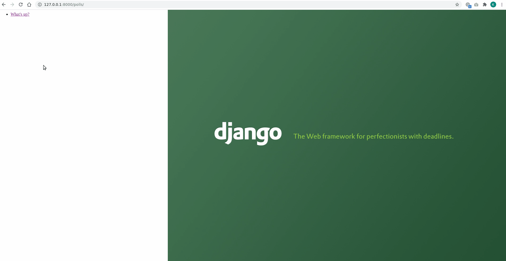
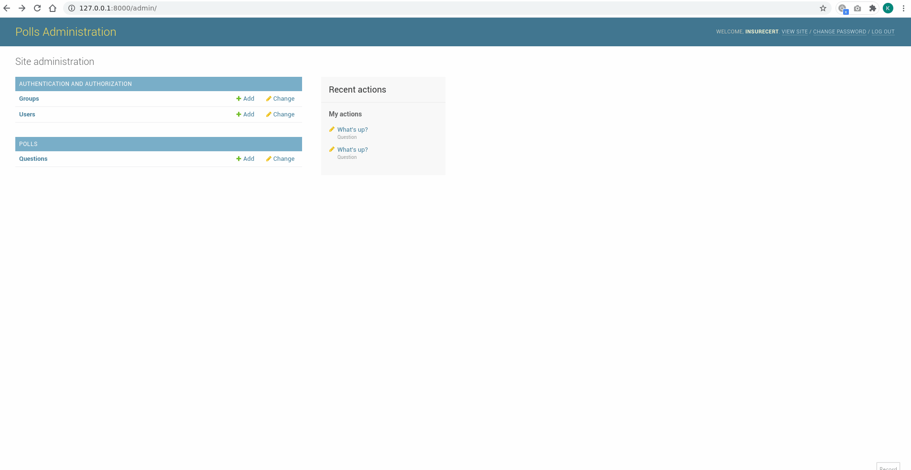

# Django App

A Django poll application which includes an admin panel to manage the questions and choices seen in the poll app. In the poll app, we’ll have the following four views:

**Question “index” page** – displays the latest few questions.  
**Question “detail” page** – displays a question text, with no results but with a form to vote.  
**Question “results” page** – displays results for a particular question.  
**Vote action** – handles voting for a particular choice in a particular question.

   

## Poll App

## Admin
